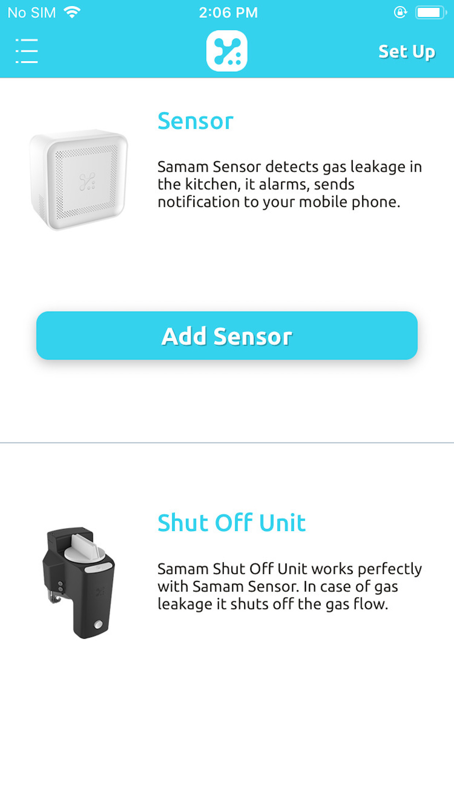
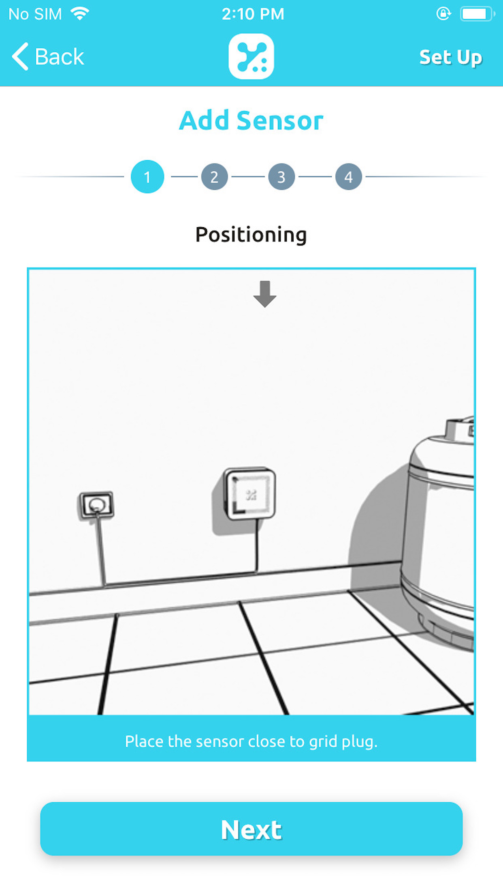

Step 1 : Please make sure that your mobile phone is connected to WiFi and Bluetooth is open.

Step 2 : Click on <strong>"Add Sensor"</strong> button

Step 3 : Give a name for the sensor device

Step 4 : Please review the instructions then click <strong>&ldquo;Next&rdquo;</strong>

Step 5:  Once <strong>&ldquo;Samam Sensor is detected&ldquo;</strong> label is seen, please click on <strong>&ldquo;Next&rdquo;</strong> button. If the label is not showing up, press the button of the sensor device for 10 seconds until it illuminates red.

Step 6: Enter WiFi password and click on <strong>&ldquo;Next&rdquo;</strong> button.

Step 7: Mobile app will start transferring information to the Sensor. Please wait till you see the <strong>"Success"</strong> message.

If you couldn’t see the <strong>"Success"</strong> message, press the button of the sensor device for 10 seconds until it illuminates red and restart sensor registration process. Return to step 1.
