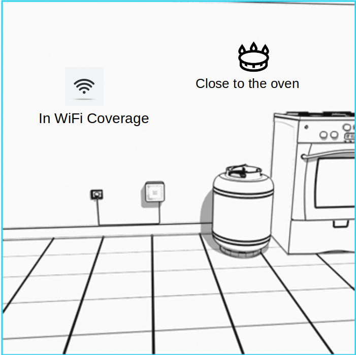

Placing the Sensor:

Please unpack the sensor device and place it on the wall according to the instructions explained below.

1.Sensor should be close to the oven. So in case of leakage it detects in early state.

2.Sensor powered by grid so should be nearby grid electricity. Power adapter cable length is 1m.

3.Sensor should be in home WiFi coverage always to notify user through mobile app.

Step 1: Place the Wall-mount plastic

Fix the plastic to the chosen place in the wall by washers and screws.

Step 2 : Connect power adapter

Power adapter should be connected to jack behind the Sensor device .

Step 3 : Attach sensor to the wall-mount plastic

After powering the sensor, attach the Sensor device on wall-mount plastic by attachment points.

Great ! You have placed the Sensor device correctly. Next step is setting up Sensor through mobile app.
