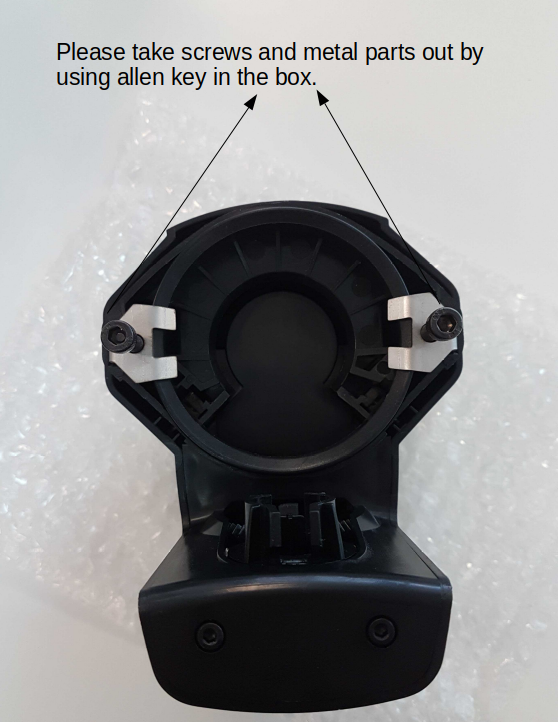
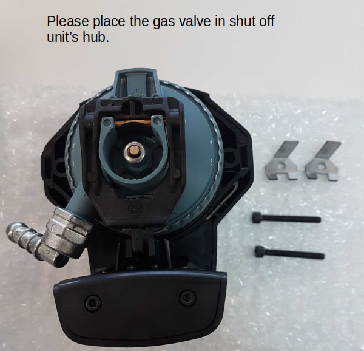
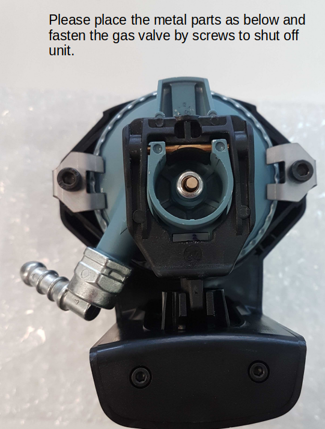
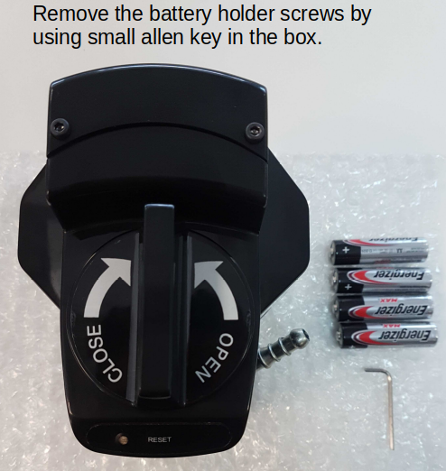

<h3 id="Placing-the-gas-valve-in-Shut-Off:"><strong>Placing the gas valve in Shut Off:</strong></h3>

Place the gas valve according to diagrams below.

Please make sure that you can rotate the valve by manual switch smoothly.

<h3>&nbsp;</h3>
<h3 id="Place-the-batteries"><strong>Place the batteries</strong></h3>

Please take the battery lid out and place 4 batteries according to spring and conductor orientation.

The correct battery placement is shown below:

Then close the battery lid and place the 2 screws and tight them by allen key.
