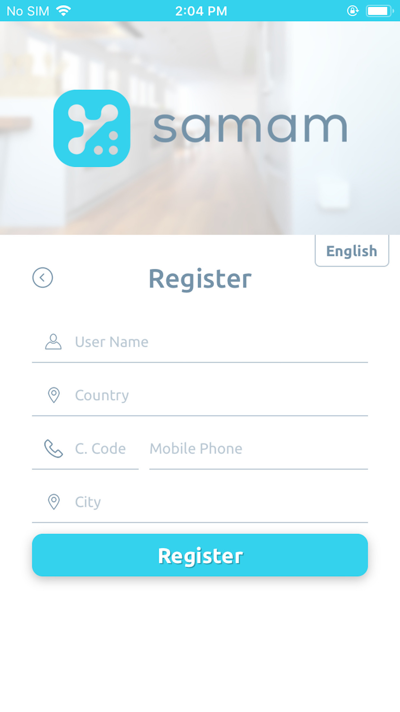

Please get the Sensor and Shut Off unit out from the box. Installation starts with Sensor, then continued with mobile app and Shut Off unit.

<strong>Mobile App Setup</strong>

Please get Samam mobile application from App Store or Google Play Store.

Step 1: Registration

Please fill the blanks on the mobile app registration form and click Register button to submit information. Then, a pop-up will appear.

Step 2 : SMS Verification

Enter the code received in the SMS message sent to the phone number entered in step 1.

Once the SMS code is verified, user is registered. Next step is registering the Sensor device.
